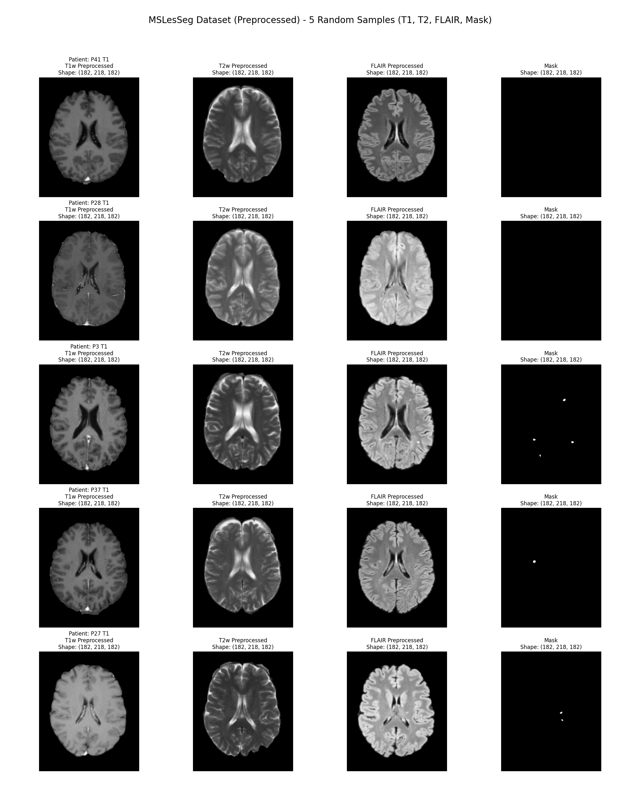
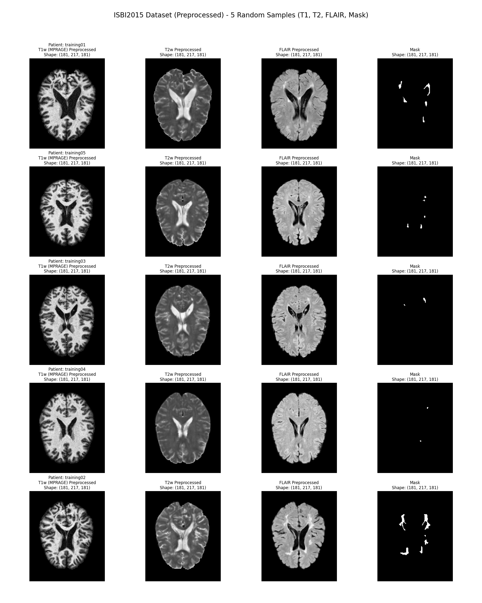

# Preprocessed MRI Dataset EDA Analysis

This report presents a multimodal view of **5 random patient samples** from both the ISBI 2015 and MSLesSeg datasets *after* they have undergone their respective preprocessing pipelines. 

## Dimensional Consistency
One of the primary goals of preprocessing is achieving a uniform geometric space. The images below confirm the successful standardization of the array structures:
- **MSLesSeg Preprocessed Data**: All imaging modalities (T1, T2, FLAIR) and the mask share identical dimensions of **$182 \times 218 \times 182$**. This indicates successful affine registration to the MNI152 template space.
- **ISBI 2015 Preprocessed Data**: All longitudinal and intra-patient imaging modalities share identical dimensions of **$181 \times 217 \times 181$**, confirming proper rigid alignment and bounding.

## 1. MSLesSeg Dataset (Preprocessed)
The samples below were randomly extracted from the preprocessed directory. Notice that skull-stripping (`bet`) has removed extra-cranial tissues, and all sequences are spatially aligned.

## 2. ISBI 2015 Dataset (Preprocessed)
The samples below showcase the ISBI dataset after N4 bias correction, skull stripping, and longitudinal rigid registration. The contrast, particularly on FLAIR sequences, is well-preserved for lesion segmentation.

## Summary
The visual inspection confirms that the preprocessing algorithms applied to these datasets effectively standardized the input dimensions across patients. The alignment between the input feature maps (T1, T2, FLAIR) and the target ground truth (Mask) is exact, making these datasets ready to be batched and fed into a deep learning model for segmentation.
